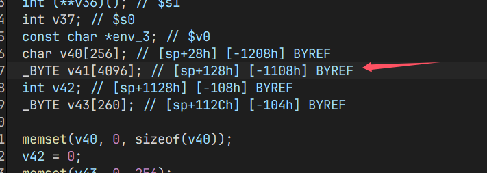
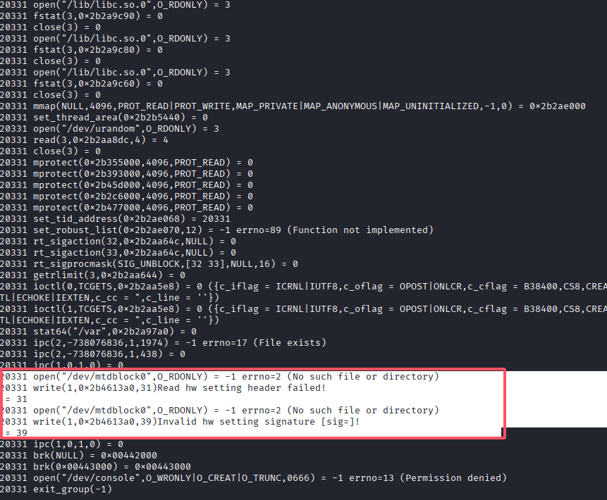

# TOTOLINK T10 Stack-Based Buffer Overflow in cstecgi.cgi (No PoC)

## Affected Products
- TOTOLINK T10 Firmware 4.1.8cu.5083 (confirmed)
- Likely also 4.1.8cu.5207
- Other versions with same cstecgi.cgi behavior

## download address

here you can download the firmware

https://www.totolink.net/home/menu/detail/menu_listtpl/download/id/172/ids/36.html

## details:

A stack-based buffer overflow vulnerability exists in the HTTP login request handling logic of the TOTOLINK T10 router.
 The issue is located in the `/cgi-bin/cstecgi.cgi` binary, where user-controlled input from an HTTP request is written into a fixed-size stack buffer using the `sprintf` function without proper bounds checking.


During processing of a login request (`action=login`), the application constructs a JSON string using attacker-controlled data, including the HTTP request body and HTTP header values. This data is written into a fixed-size stack buffer (`v41[4096]`) using `sprintf`, which does not enforce any length restrictions. As a result, excessive input may cause a buffer overflow, leading to memory corruption and potential denial of service




```c

sprintf(
  v41,
  "{\"topicurl\":\"loginAuth\",\"loginAuthUrl\":\"%s&http_host=%s&flag=ie8\"}",
  v10,
  env_3
);
```

`v10`: Data read from standard input (`stdin`), corresponding to the HTTP POST body

`env_3`: Environment variable `http_host`, derived from the HTTP request header

## Root Cause

Use of `sprintf` without bounds checking

Writing attacker-controlled data into a fixed-size stack buffer

No validation or truncation of input length

## Reachability

The vulnerable code path is executed during normal HTTP login request processing (`action=login`)

The affected logic is executed before request dispatch to specific handler functions

The vulnerability is reachable during standard web management operations

No authentication is required to reach the vulnerable code path

NOTE:

No Proof-of-Concept (PoC) is provided.

Reproduction in an emulated environment is not possible due to hardware-specific initialization logic. The vulnerable code path is guarded by `apmib_init()`, which requires access to valid MTD flash devices (e.g., `/dev/mtdblock0`) containing hardware configuration data.

In emulated environments, this initialization fails, preventing execution of the affected code path. On real devices, this condition is satisfied during normal operation.




