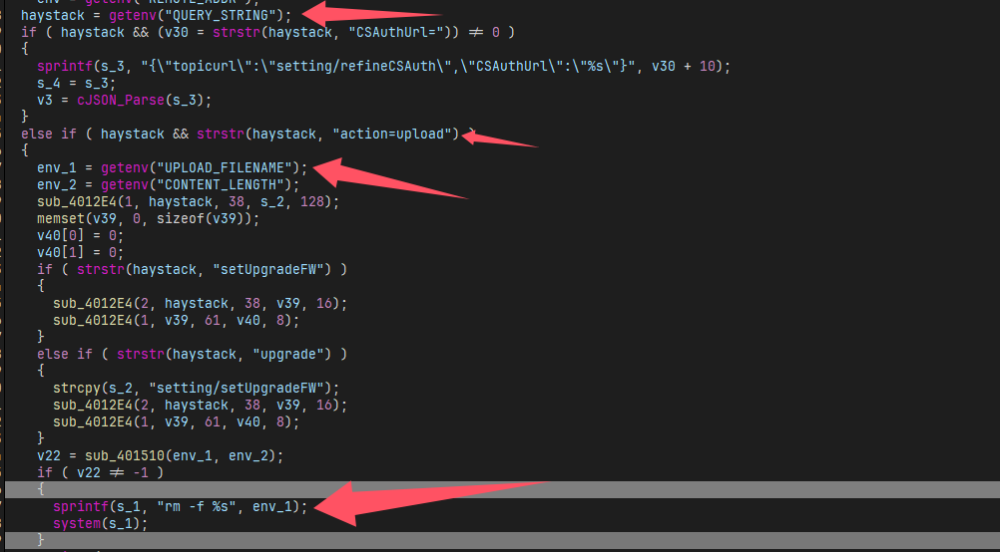
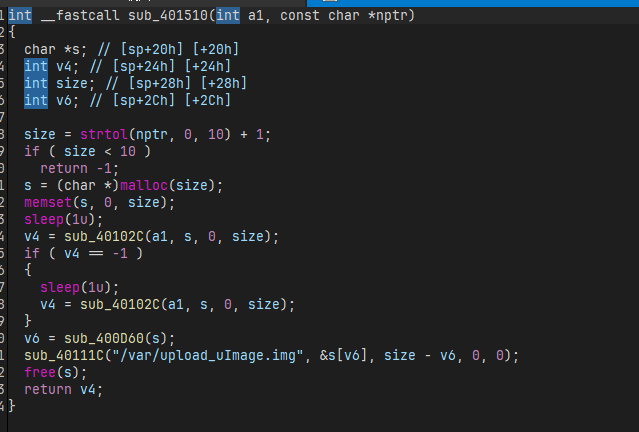
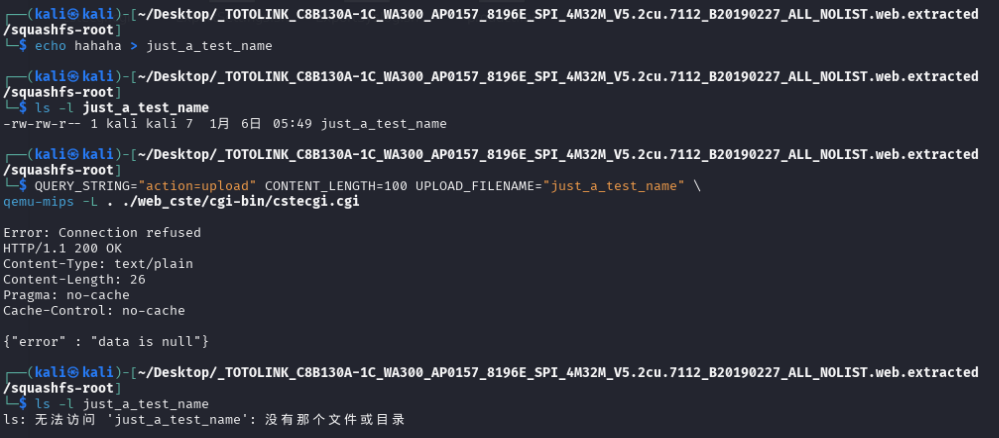

# TOTOLINK WA300 RCE in cstecgi.cgi

## Affected Products
- TOTOLINK WA300_Firmware V5.2cu.7112_B20190227

## download address

here you can download the firmware

https://www.totolink.net/home/menu/detail/menu_listtpl/download/id/135/ids/36.html

## details:

A command injection vulnerability exists in the TOTOLINK WA300 router firmware.
The issue is located in the `/cgi-bin/cstecgi.cgi` CGI binary, which is responsible
for handling multiple web management actions.

When processing HTTP requests containing the `action=upload` parameter, the CGI
program retrieves user-influenced data from CGI environment variables, including
`UPLOAD_FILENAME` and `CONTENT_LENGTH`. These values originate from the HTTP upload
request and are not properly validated or sanitized.



During request handling, the value of `UPLOAD_FILENAME` is directly embedded into
a shell command using the `sprintf` function. The constructed command is subsequently
executed via a call to `system()`.

Because the `UPLOAD_FILENAME` variable is fully controllable by a remote client and
no validation or escaping is performed before command execution, an unauthenticated
attacker can influence the shell command executed by the system. This behavior
results in a command injection vulnerability, which may lead to arbitrary command
execution in the context of the web service.

Here is the sub_401510() function,it didn't do any validation or escaping operation.



## Root Cause

The root cause of the vulnerability is the unsafe construction and execution of
shell commands using untrusted input.

Specifically:
- The CGI program retrieves the `UPLOAD_FILENAME` value directly from the CGI
  environment without validation.
- The value is concatenated into a shell command using `sprintf`, which performs
  no bounds checking or escaping.
- The resulting command string is executed using the `system()` function.

This design violates secure coding practices by combining untrusted external input
with shell command execution. The lack of input validation, sanitization, or the use
of safer file-handling APIs directly leads to the command injection vulnerability.

## Reachability

The vulnerable code path is reachable through standard HTTP requests sent to the
device's web management interface.

Key reachability characteristics include:
- The vulnerable logic is triggered when handling requests containing the
  `action=upload` parameter.
- No authentication is required to reach the affected code path.
- The vulnerable code is executed during normal request processing before any
  backend service interaction.
- Failure of backend communication does not prevent the vulnerable function from
  being executed.

As a result, a remote unauthenticated attacker can reach the vulnerable code path
under normal operating conditions on a real device.

## PoC

The vulnerability can be verified using a non-intrusive side-effect test.

A benign test file is created in the working directory before sending the request.
After triggering the vulnerable upload handler, the test file is removed, confirming
that a system command was executed using attacker-influenced input.

The following figure demonstrates the verification process.



``````bash
echo hahaha > just_a_test_name 
ls -l just_a_test_name
QUERY_STRING="action=upload" CONTENT_LENGTH=100 UPLOAD_FILENAME="just_a_test_name" \
qemu-mips -L . ./web_cste/cgi-bin/cstecgi.cgi
ls -l just_a_test_name   
``````


